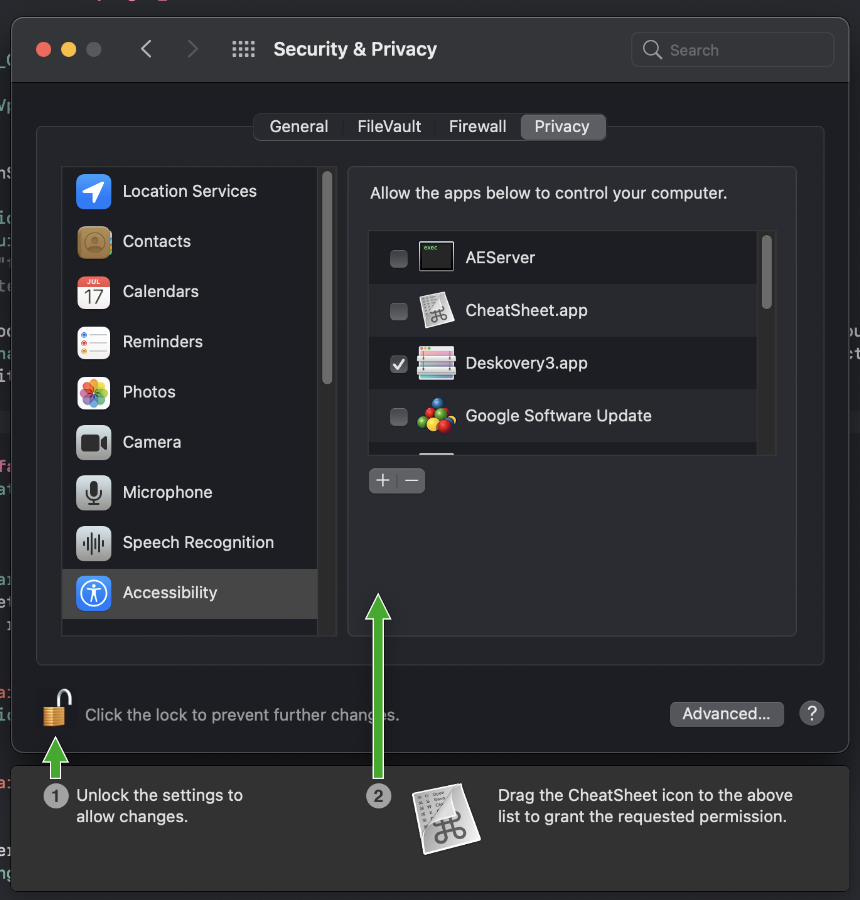

#  Floating instructions view

Show a floating instructions view to guide the users in setting your macOS app's permission.

1. Run this show case app, you will get an instructions panel like below
    

2. The app does not require any permission, but you are responsible to create your own floating window in `func windowDidAppearOnScreen(windowInfo:)`, a sample code looks like below:

```swift
  func windowDidAppearOnScreen(windowInfo: WindowInfo) {
        
        debugPrint("Bingo!")
        
        let rect = CGRect(origin: windowInfo.frame.origin.applying(CGAffineTransform.init(translationX: 0, y: -232)), size: CGSize(width: 668, height: 446))
        
        omInstructions = OMAuxiliaryInstructionsPanel(contentRect: rect, styleMask: [.nonactivatingPanel, .borderless, .hudWindow, .closable], backing: .buffered, defer: false)
        
        self.omInstructions!.backgroundColor = .clear
        
        let imageView = NSImageView(frame: CGRect(origin: .zero, size: CGSize(width: 668, height: 446)))
        
        imageView.autoresizingMask = [.width,.height]
        
        imageView.image = NSImage(named: "InstructionsView")
        
        self.omInstructions!.contentView?.addSubview(imageView)
        
        self.omInstructions!.imageView = imageView
            
        self.omInstructions!.level = .floating
        
        self.omInstructions!.makeKeyAndOrderFront(self)
                                  
        self.omInstructions?.delegate = self
        
        self.omInstructions?.ignoresMouseEvents = true
        
        
    }
```

